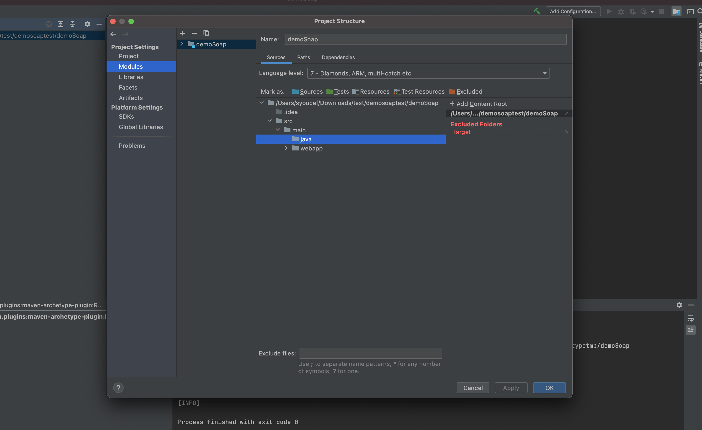

# Suite Docker

docker run -d nginx

docker run -d -p 9999:80 nginx 

docker run --name my-sql -e MYSQL_ROOT_PASSWORD=root -d mysql

docker exec -it  my-sql mysql --password

Montrer l'image alpine et quelques commandes ....

Inspecter un conteneur : ``docker inspect``

Voir les logs ``docker logs


```java 
FROM nginx
COPY index.html /usr/share/nginx/html
EXPOSE 80
```
 

``docker build -t cm18novembre .``

``docker run -d -p 9194:80 cm18novembre


``docker run -it alpine 
 

# Brève introduction à Docker 

docker run image_name : permet de créer un conteneur de l'image mage_name

docker run -d image_name : permet de démarrer un conteneur en service de fond

la valeur par défaut de la version de l'image est ``latest``

docker run image_name:tag

exemples : 
doicker run image_name:3.0 (ici on précise la version à utiliser et si cette version n'est pas précisée, la valeur par défaut est latest)


docker ps : permet de lister tous les conteneurs en cours d'eéxution 

chaqsue conteneur dispose d'un identifiant unique 

docker ps -a 

docker run --name my-sql -e MYSQL_ROOT_PASSWORD=root -d mysql


# API rest avec RestController


```java 
@RestController
public class RestControlleur {

    @Autowired
    private ProduitInterface produitInterface;

    @GetMapping(value = "/bonjour")
    public String afficher(){
        return "Bonjour de @RestController";
    }

    @GetMapping(value = "produits")
    public List<Produit> produits(){
        return produitInterface.findAll();
    }

    @GetMapping("produits/{identifiant}")
    public Produit getProduit(@PathVariable int identifiant){
        return produitInterface.findById(identifiant).get();
    }

    @PostMapping(path = "/produits")
    public Produit save(@RequestBody Produit produit){
        return  produitInterface.save(produit);
    }


    @PutMapping("/produits")
    public Produit update(@RequestBody Produit produit, @PathVariable int identifiant){
        produit.setIdentifiant(identifiant);
        return  produitInterface.save(produit);
    }


    @DeleteMapping("/produits/{identifiant}")
    public void delete(@PathVariable int identifiant){
        produitInterface.deleteById(identifiant);
    }
}


```


# Travail à faire le mercredi 20 octobre


 
##  Importante : le mercredi 3 novembre après-midi aura lieu une présentation de 15 minutes maximum par groupe, pour la présentation du cas d'utilisation et de la couche DAO et du choix des langages (ou framework) à utiliser côté client

# Terminer la description de votre cas d'application + diagrames UML 

# Appréhender le framework Hibernate (annotations JPA, en implémentant les différentes associations de votre cas d'application)

# Déterminer le choix du langage et/ou framework à utiliser pour la partie front-end
 
    


#### Lombok 

```java
<!-- https://mvnrepository.com/artifact/org.projectlombok/lombok -->
<dependency>
    <groupId>org.projectlombok</groupId>
    <artifactId>lombok</artifactId>
    <version>1.18.22</version>
    <scope>provided</scope>
</dependency>


# Cours du lundi 18 octobre 
#### Utilisation de MySQL au lieu de H2

```java 
#Utulisation d'une base de données "en mémoire" H2 (le données sont sauvegardé dans la mémoire vive, 
#RAM – Random Access Memory)

spring.datasource.url=jdbc:h2:mem:produits
spring.h2.console.enabled=true

#Utulisation d'une base de données MySQl (les données sont sauvegardées sur disque)

spring.datasource.url=jdbc:mysql://localhost:8889/produits  ou 
spring.datasource.url=jdbc:mysql://localhost:8889/produits?serverTimezone=UTC
spring.datasource.username=root
spring.datasource.password=root
spring.datasource.driver-class-name=com.mysql.cj.jdbc.Driver
spring.jpa.hibernate.ddl-auto=create
```


### Utilisation de Spring Data Rest (RepositoryRestResource)

```java
@RepositoryRestResource
public interface ProduitInterface extends JpaRepository<Produit, Integer> {} 
```

Pour changer le chemin d'accès aux resources : ``spring.data.rest.base-path=/mesapi``


### Quelques exemples ("extension de l'interface ProduitInterface")

http://localhost:8989/mesapi/produits?page=0&size=1

http://localhost:8989/mesapi/produits?sort=prix,desc


```java 
@RepositoryRestResource
public interface ProduitInterface  extends JpaRepository<Produit, Integer> {
    public List<Produit> findByProduitType(ProduitType type);
    public List<Produit> findByPrixGreaterThan(double prix);
    public List<Produit> findByPrixLessThan(double prix);
}
```


http://localhost:8989/mesapi/produits/search/findByPrixLessThan?prix=445


Consulter le lien : https://spring.io/projects/spring-data-rest

##### Renvoyer la valeur de la clé primaire : 

```java

    @Bean
    CommandLineRunner runner(ProduitInterface produitInterface, RepositoryRestConfiguration configuration){
        return args -> {
            configuration.exposeIdsFor(Produit.class);
            produitInterface.save(new Produit(1, "Tablette", 1400, ProduitType.INFORMATIQUE));
            produitInterface.save(new Produit(2, "Switch", 140, ProduitType.AUTRE));
            produitInterface.save(new Produit(3, "Routeur", 400));
            produitInterface.save(new Produit(4, "Ordinateur", 44));
        };
    }
```

#### Projection avec Spring Rest

Remarque : les projections doivent être définies dans le même répertoire que les "entities"

```java 
@Projection(name = "designation", types = Produit.class)
public interface Projection1 {
    public String getDesignation();
}
```
exemple de l'utilisation de la projection 1

http://localhost:8989/mesapi/produits?projection=designation


```java
@Projection(name = "designationprix", types = Produit.class)
public interface Projection2 {
    public String getDesignation();
    public double getPrix();
}
```

#### graphql 

https://graphql.org

# Cours du vendredi 8 octobre 
#### Configuration de Jaxws et Jersey

```java
@Configuration
public class Maconfig {
    @Bean
public ResourceConfig maconfiguration(){
    ResourceConfig resourceConfig = new ResourceConfig();
    resourceConfig.register(ApiJaxrs.class);
    return resourceConfig;
}

@Bean
SimpleJaxWsServiceExporter simpleJaxWsServiceExporter(){
        SimpleJaxWsServiceExporter exporter = new SimpleJaxWsServiceExporter();
        exporter.setBaseAddress("http://0.0.0.0:8981/");
        return exporter;
}
}
```


#### API rest 

```java 
package fr.polytech.democm8octobre.demo.web;

import fr.polytech.democm8octobre.demo.dao.Produit;
import fr.polytech.democm8octobre.demo.dao.ProduitInterface;
import org.springframework.beans.factory.annotation.Autowired;
import org.springframework.stereotype.Component;

import javax.ws.rs.*;
import javax.ws.rs.core.MediaType;
import java.lang.reflect.Array;
import java.util.ArrayList;
import java.util.List;

@Component
@Path("/commerce")
public class ProduitControlleur {
    // injection des dépendances et inversion de contrôle

    @Autowired
    private ProduitInterface produitInterface;

    @Path("/produits")
    @GET // c'est le verbe ....
    // la méthode c'est le ressource ....
    @Produces({MediaType.APPLICATION_JSON})
    public ArrayList<Produit> produitList(){
        return (ArrayList<Produit>) produitInterface.findAll();
    }

    @Path("/produits/{identifiant}")
    @GET
    @Produces({MediaType.APPLICATION_JSON})
    public Produit getProduit(@PathParam(value = "identifiant") int identifiant){
        return produitInterface.findById(identifiant).get();
    }


    // ajouter un produit ....
    @Path("/produits")
    @POST
    @Produces({MediaType.APPLICATION_JSON})
    public Produit save(Produit produit){
        return produitInterface.save(produit);
    }


    // Mise à jour ....
    @Path("/produits/{identifiant}")
    @PUT
    @Produces({MediaType.APPLICATION_JSON})
    public Produit save(Produit produit, @PathParam("identifiant") int identifiant){
        produit.setIdentifiant(identifiant);
        return produitInterface.save(produit);
    }

    // Suppression d'un produit ....
    @Path("/produits/{identifiant}")
    @DELETE
    @Produces({MediaType.APPLICATION_JSON})
    public void save(@PathParam("identifiant") int identifiant){
        produitInterface.deleteById(identifiant);
    }
}
```

#### Service web SOAP (Simple Object Access Protocol)


# Travail à faire le mercredi 29 septembre
**Important : ce travail doit être déposé dans votre GIT personnel et pas celui du projet.**
1. Terminer l'exercice n°2 sur la (dé)sérialisation XML/Objet. **Ne pas faire la partie sur Json.**
2. Faire le tutoriel "Services Web SOAP" sur : 

a. L'implémentation d'un service web SOAP (génération de skeleton et de proxy)

b. L'utilisation de SoapUI pour tester un service web SOAP (https://www.soapui.org/downloads/soapui.html)

c. Le développement d'un client Java

d. Le développement d'un client PHP 

3. Apréhender le framework Hibernate et l'utilisation des annotations JPA. A la fin de la séance avoir un descriptif sur une page maximum sur votre cas d'application. 


# Cours du mardi 28 septembre (pas abordé)


## Mise en place de l'environnement de développement

Pour réaliser les manipulations suivantes, vous aurez besoin d'un IDE et d'un serveur d'application. Pour l'IDE, j'utilise Intellij (libre à vous d'utiliser votre IDE préféré). Pour le déploiement d'un service web, j'utilise le serveur d'application Glassfish.  La version de Java que j'utilise est la version 8. Attention : l'utilisation d'une version ultérieur ne permet de reproduire les manipulation suivante, car elle intègre pas les utilitaires, entre autre, de génération ni de **stub** (proxy) ni de **skeleton** (voir plus loin, bien saisir l'objectif de ces deux artefacts). 


Pour que Maven génère un war au lieu d'un jar (**attention : on peut générer un war sans ajouter ces deux plugings mais le service sera inaccessible**), on ajoute les deux plugings suivants, dans bien sûr le pom.xml 😁.  

```xml 
<plugin>
        <artifactId>maven-war-plugin</artifactId>
        <configuration>
          <failOnMissingWebXml>false</failOnMissingWebXml>
        </configuration>
      </plugin>

      <plugin>
        <groupId>org.apache.maven.plugins</groupId>
        <artifactId>maven-compiler-plugin</artifactId>
        <version>3.7.0</version>
        <configuration>
          <source>1.8</source>
          <target>1.8</target>
        </configuration>
      </plugin>
```


Il existe deux approches pour développer un service web SOAP : (i) l'approche Bottomp-up et (ii) l'approche top-down. La première approche consiste à définir d'abord les méthodes (opérations) du service en question et puis générer son fichier de description wsdl (Web Service Description Language). C'est la méthode la plus intuitive. La génération du fichier de description du service se fait l'aide de l'utilitaire ``wsgen``.  La deuxième approche consiste à définir d'abord  le contrat du service. 

###  Définition d'un service web SOAP avec l'approche bottomp-up

Commençons d'abord par générer un projet web, en utilisant Maven. Choisissez l'archetype ``org.apache.maven.archetype:maven-archetype-webapp``. Soit demoSoap, ``l'ArtifactId`` de ce projet et ``fr.polytech`` son  ``GroupId``.  Une fois le projet généré , supprimer le fichier de configuration ``web.xml``qui se trouve dans ``webapp/WEB-INF``. Ajouter le sous-répertoire ``main/java`` et préciser que vos code sources sont sauvegardés dans répertoire. Cliquer sur ``Project structure``. Définir le répertoire ``java``comme ressources, comme illustré par les deux figures suivantes. 





Un exemple d'un service web (``testsoap``), exposant une seule méthode appelée ``affichageBonjour``, prenant en paramètre une chaîne de caractère, est donné par le code suivant. 


```java    
package com.test;
import javax.jws.WebMethod;
import javax.jws.WebService;
@WebService(serviceName = "testsoap", targetNamespace = "http://www.polytech.fr")
public class MonService {

    @WebMethod(operationName = "affichageBonjour")
    public String afficherBonjour(String nom){
        return "Bonjour " + nom;
    }
}
```

# Travail à faire le mercredi 22 septembre 

1. Finir les tutoriels sur Maven que vous trouverez sur Arche ou en utilisant ce lien [https://drive.google.com/drive/folders/1oNl4g0TTMgDSUMWt8V_Z2Z0ubSXtjUFG](https://drive.google.com/drive/folders/1oNl4g0TTMgDSUMWt8V_Z2Z0ubSXtjUFG) <br>
Les vesrions pdf se trouvent sur le site du cours <br> A partir de la vidéo 6, vous aurez besoin d'un concept important en prgrammation web (le modèle **MVC, Modèle-Vue-Contrôleur**). Vous pouvez vous contenter de rafaire les manipulations, sans vraiemnet saisir tout son sens. En cas de difficulté à les réliser, vous pouvez laisser les vidéos 6 à 10, pour une autre séance, une fois qu'on aura discuté et présenté ce concept.  
2. Prise en main de Markdown (vos rapports doivent être rédigés avec Markdown)
3. Réfléchir sur le cas d'application de votre projet (exemples : application e-commerce, application de gestion des adhérents d'une association,  )
5. Installer IntelliJ IDEA
6. Renseigner les noms et prénoms des groupes et un lien vers votre dépôt GIT (utiliser le lien Noms des groupes du bloc-notes collaboratif que vous trouverez sur le site du cours)

